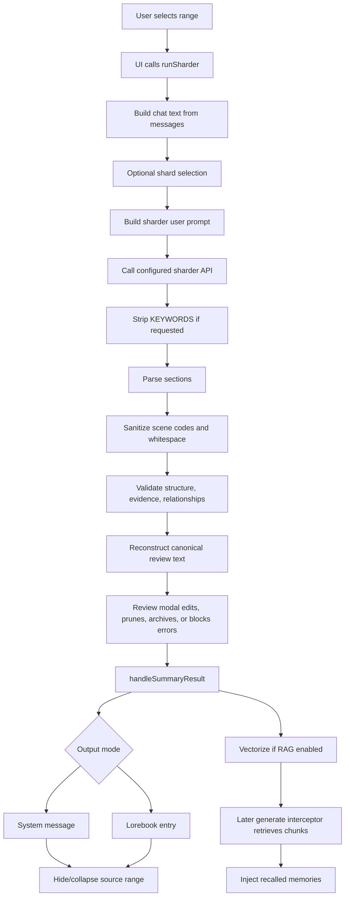

# Architectural Memory Repository Audit and Plan

## 1. Executive Summary

Confirmed: Summary Sharder already has two main summarization paths: Basic Summary and Sharder Mode. Basic Summary produces prose through `core/api/summary-api.js`. Sharder Mode produces a structured narrative Memory Shard through `core/api/single-pass-api.js`, `core/sharder/single-pass-pipeline.js`, and shared parsing/reconstruction in `core/summarization/sharder-pipeline.js`.

Confirmed: the current narrative Sharder can be extended without replacing it. The repository already separates some behavior by `settings.sharderMode`, but it does not have a general mode registry. The narrative section list is hard-coded in several files, so Architectural Mode should be added as a Sharder profile or subtype first, not as a replacement prompt.

What is missing: Architectural Mode needs a mode/profile setting, its own prompt, its own section registry, deterministic DECISIONS parsing and validation, architectural lifecycle rules, mode-aware review UI labels, mode-aware RAG chunking, and explicit saved-output identification. Existing code does not validate numeric section caps, decision IDs, legal lifecycle transitions, EVENT-to-DECISION references, or `===END===` as a hard output contract.

Safest approach: add a small mode-aware layer around the existing sharder pipeline. Keep rendered shard text as canonical persisted data for the MVP, but add mode/profile metadata in settings, saved headers, and RAG metadata so narrative and architectural shards do not get mixed.

Product-owner amendment: Architectural output has mandatory KEY metadata plus seven content sections: TIMELINE, DECISIONS, EVENTS, DEVELOPMENTS, DIALOGUE, THREADS, CURRENT. KEY is not an ordinary content section and must be rendered first, mandatory, non-selectable, non-prunable, excluded from content-section caps, and validated independently.

Largest risks:

- Section definitions are duplicated across prompt text, parser/reconstructor, validation, review UI, RAG chunking, retrieval, shard selection, and pruning analysis.
- Existing RAG rolling behavior is useful but hard-coded to `relationshipShifts`, `callbacks`, and `looseThreads`.
- Existing pipe parsing treats `|` as an item-boundary signal, not a safe field delimiter.
- The prompt says section caps are strict, but code currently does not enforce those caps.
- `===END===` is stripped during normalization and is not restored by rendering.

## 2. Plain-Language Repository Map

Confirmed relevant directories:

| Path | What it does |
|---|---|
| `index.js` | Extension entrypoint. Loads settings, initializes UI, registers the RAG generation interceptor, and wires UI callbacks to summarization/sharder actions. |
| `core/api/` | API orchestration. `summary-api.js` runs Basic Summary; `single-pass-api.js` runs Sharder Mode; `single-pass-queue-api.js` runs batch Sharder; `api-client.js` calls SillyTavern, external, or compatibility APIs. |
| `core/summarization/` | Prompt and output support. `prompts.js` stores default prompts; `sharder-pipeline.js` parses/reconstructs sectioned shards; `output.js` saves results to system messages or lorebooks and triggers vectorization. |
| `core/sharder/` | Deterministic checks around Sharder output: sanitizer, fidelity validator, evidence checker, relationship guard, pruning analyzer, and message coverage analyzer. |
| `core/rag/` | Vector chunking, collection naming, vector insertion/query, retrieval, reranking, scoring, archive, and debug pipeline. |
| `core/chat/` | Reads chat messages, builds chat text, and manages hidden/collapsed summarized ranges. |
| `ui/` | Settings panel, FAB, modals, review screens, prompt editor, RAG browser/debug/settings, lorebook selection, and styles. |

Glossary:

- Shard: saved long-term memory text generated from a message range.
- Section registry: a single source of truth for which sections exist, their keys, labels, caps, parser rules, and RAG behavior.
- Parser: code that turns model text into JavaScript data.
- Renderer/reconstructor: code that turns JavaScript data back into text.
- RAG: retrieval-augmented generation; saved shard chunks are vectorized and injected into later prompts.
- Chunk: a piece of text stored in the vector database with metadata.
- Rolling entity: a section item tracked across shards by a derived or explicit stable key, allowing later versions to update or resolve the same logical item rather than creating unrelated duplicates. Summary Sharder currently applies rolling behavior to relationships, callbacks, and threads. Architectural Mode may generalize this mechanism for DECISIONS.
- Diagnostic: a parser or validator message shown to the user, usually `error`, `warning`, or `info`.
- Metadata section: a required non-content record such as KEY. It is rendered and validated, but not selected, pruned, or counted against content-section caps.

## 3. Current Sharder Data Flow



Step-by-step confirmed trace:

1. User chooses a range in `ui/ui-manager.js`. `renderSettingsUI()` renders Sharder controls; `toggleSharderControls()` switches Basic Summary buttons off and Sharder buttons on when `settings.sharderMode` is true. `runManualSummarizeUI()` routes manual input to either summary or sharder flows.
2. Existing shard selection is handled by `ui/modals/summarization/shard-selection-modal.js::openShardSelectionModal()`. If Sharder Mode plus RAG is enabled, it returns no selected shards because RAG handles retrieval granularity. Otherwise it calls `findSavedExtractions()` and lets the user select saved shards.
3. `core/api/single-pass-api.js::runSharder()` starts the operation, calls `runSharderHeadless()`, opens `openSharderReviewModal()`, and sends accepted output to `handleSummaryResult()`.
4. `runSharderHeadless()` calls `buildSinglePassChatText()`, which uses `core/chat/chat-text-builder.js::buildChatText()` with `indexFormat: 'msg'` and `core/processing/context-cleanup.js::applyContextCleanup()`.
5. `runPipelineWithAnalysis()` calls `core/sharder/single-pass-pipeline.js::runSharderPipeline()`, then `analyzeMessageCoverage()` and optionally `analyzeSinglePassPruning()`.
6. `runSharderPipeline()` gets the sharder prompt from `getSharderPrompts()`, builds the user prompt with `buildSharderUserPrompt()`, calls the chosen API through `callSharderApi()`, parses optional `KEYWORDS:`, parses sections with `parseExtractionResponse()`, sanitizes through `sanitizeSinglePassSections()`, validates with `validateSinglePassOutput()`, `checkSinglePassEvidence()`, and `checkRelationshipCoherence()`, then reconstructs text with `reconstructExtraction()`.
7. `parseExtractionResponse()` in `core/summarization/sharder-pipeline.js` normalizes bracket headers to `### emoji SECTION`, initializes every hard-coded `SHARDER_SECTIONS` key, splits freeform and item sections, and returns a sections object.
8. `reconstructExtraction()` always emits every narrative `SHARDER_SECTIONS` entry using `### emoji SECTION` headings. Empty selected lists become `(None)`.
9. `ui/modals/summarization/single-pass-review-modal.js::openSharderReviewModal()` normalizes items, renders diagnostics, renders all `SHARDER_SECTIONS`, lets the user edit textareas, select/deselect items, prune items, archive items to warm RAG storage, regenerate, and save.
10. Error-level diagnostics block save in `openSharderReviewModal()` before returning `confirmed: true`.
11. `core/summarization/output.js::handleSummaryResult()` writes either a system message via `insertSystemMessage()` or lorebook entries via `saveToLorebook()`.
12. System message persistence format is `[MEMORY SHARD: Messages X-Y]\n\n${content}` for Sharder Mode and `[SUMMARY: Messages X-Y]` for Basic Summary.
13. Lorebook persistence stores raw shard text in `entry.content`; entry name defaults to `Memory Shard {start}-{end}` for Sharder Mode.
14. If RAG is enabled, `handleSummaryResult()` calls `vectorizeShardSectionAware()` or `vectorizeShard()` for Sharder Mode, and `vectorizeStandardSummary()` for Basic Summary.
15. Section-aware RAG uses `core/rag/chunking.js::chunkShardBySection()`, which categorizes sections into `superseding`, `cumulative`, and `rolling` behaviors.
16. Later generation calls `core/rag/retrieval.js::rearrangeChat()` through `globalThis.summary_sharder_rearrangeChat` registered in `index.js`. It queries vector collections, applies scoring/reranking, fetches latest superseding/rolling/anchor/development fallback chunks, formats injection text, and injects it with `setExtensionPrompt()` or a chat variable.

Stored data shapes confirmed:

```js
// Parsed sharder item
{
  id: "events-0",
  content: "(S12:1) event text",
  weight: 3,
  selected: true,
  edited: false,
  sceneCodes: [{ code: "[S12:1]", startMsg: 12, sceneNum: 1 }]
}

// Pipeline result
{
  raw,
  reconstructed,
  sections,
  extractedKeywords,
  diagnostics,
  severity,
  stats,
  metadata: { startIndex, endIndex, hasExistingShards, existingShardCount, headerType: "shard" }
}

// RAG chunk metadata example
{
  isSummaryChunk: true,
  startIndex,
  endIndex,
  chunkBehavior: "rolling",
  sectionType: "looseThreads",
  entityKey: "thread title",
  status: "ACTIVE",
  freshnessEndIndex: endIndex
}
```

## 4. Existing Mode and Section Architecture

Confirmed modes and workflows:

- Basic Summary: `settings.sharderMode !== true`, prompt from `settings.prompts`, API feature `summary`, optional summary review, output as `[SUMMARY: ...]`.
- Narrative Sharder Mode: `settings.sharderMode === true`, prompt from `settings.sharderPrompts.prompt`, API feature `sharder`, sectioned review, output as `[MEMORY SHARD: ...]`.
- Drafting workflow: `settings.advancedUserControl`, mutually disabled from Sharder Mode in UI; uses `core/api/casing-api.js` and `ui/modals/summarization/drafting-modal.js`.
- RAG: active settings are selected by `core/settings.js::getActiveRagSettings()`: `settings.rag` for Sharder Mode, `settings.ragStandard` for Basic Summary.

Confirmed section assumptions:

| Area | Exact current dependency |
|---|---|
| Prompt | `core/summarization/prompts.js::DEFAULT_SHARDER_PROMPT` names narrative sections and caps. |
| Parser/reconstructor | `core/summarization/sharder-pipeline.js::SHARDER_SECTIONS`, `FREEFORM_SECTIONS`, `parseExtractionResponse()`, `reconstructExtraction()`. |
| Legacy parser | `core/summarization/shard-utils.js::parseConsolidatedShard()` has its own bracket-section mappings. |
| Validator | `core/sharder/fidelity-validator.js` requires arrays for every key in `SHARDER_SECTIONS`, but does not require each section to be populated. |
| Sanitizer | `core/sharder/canonical-sanitizer.js` operates generically over parsed keys but assumes scene code style. |
| Review UI | `ui/modals/summarization/single-pass-review-modal.js` renders every `SHARDER_SECTIONS` section and only has event weight controls for `events`. |
| Pruning analyzer | `core/sharder/shard-pruning-analyzer.js` maps consolidated narrative keys to extraction narrative keys. |
| RAG chunking | `core/rag/chunking.js` has independent section maps and behavior lists. |
| Retrieval | `core/rag/retrieval-shared.js` and `core/rag/retrieval.js` pin rolling, anchors, and developments by hard-coded narrative keys. |
| Persistence discovery | `findSavedExtractions()` and `parseMemoryShard()` identify by text headers, not explicit mode metadata. |

Recommendation: add a mode-specific section registry. Without it, Architectural Mode would require synchronized edits in many files and would risk narrative regressions.

## 5. Target Architectural Mode

| Requirement | Reusable existing behavior | Requires modification | New behavior | Deferred enhancement |
|---|---|---|---|---|
| Coexist with narrative Sharder | `settings.sharderMode`, separate RAG settings already exist | Add `sharderProfile` or equivalent | Mode-aware prompt/sections | Per-profile UI polish |
| Architectural metadata and content sections only | Parser/review can iterate a section list | Section list must become mode-aware and distinguish metadata from content | Architectural registry with KEY metadata plus TIMELINE/DECISIONS/EVENTS/DEVELOPMENTS/DIALOGUE/THREADS/CURRENT content sections | Fully dynamic user-defined sections |
| Stable decision IDs | Rolling entity concept exists | Generalize entity key extraction | Explicit decision ID parser/validator | Dedicated decision registry UI |
| Structured DECISIONS | Item parser can preserve raw text | Need field parser | Parsed field map attached to item | Full custom decision editor |
| Lifecycle validation | Status parser exists for callbacks/threads | Needs architectural lifecycle rules | Transition validator | Database-backed history |
| EVENT `DEC:` references | None | Cross-reference validator | DEC reference extraction/check | Graph view |
| THREAD lifecycle | Rolling threads already exist | Add architectural thread key/status rules | Mode-specific thread parser | Thread editor |
| CURRENT mandatory | Current section exists | Enforce exactly one selected current item | Diagnostic and final-render guarantee | Rich current-state form |
| Section caps | Prompt-only now | Validator/review/final-render awareness | Strict content-section caps; final save blocked while any content section remains over cap | User-approved pruning helpers |
| `===END===` | Prompt requests it; parser strips trailing marker | Renderer must guarantee it | Marker normalization and exactly-one render | Stop-sequence integration |

## 6. Gap Analysis

| Requirement | Existing Support | Gap | Recommended Change | Risk |
|---|---|---|---|---|
| Add Architectural Mode without replacing narrative | Existing `sharderMode` boolean separates Basic Summary from Sharder | No subtype/profile | Add `settings.sharderProfile = "narrative"|"architectural"` while preserving `sharderMode` | LOW |
| Architectural metadata and content section set | Iteration over `SHARDER_SECTIONS` is reusable | `SHARDER_SECTIONS` is global narrative-only and has no metadata/content split | Introduce `getSharderSectionRegistry(settings/context)` with metadata definitions and content-section definitions | MEDIUM |
| Stable decision identity | Rolling RAG entity keys exist | No DECISIONS section or explicit ID field | Parse `ID:<kebab-case>` and store `entityKey = id` in item metadata/RAG metadata | MEDIUM |
| Structured DECISIONS records | Existing items preserve raw `content` | No field maps; naive pipe use would corrupt values | Add stateful field parser or prohibit/escape literal pipes | HIGH |
| Legal lifecycle transitions | Callback/thread status parser exists | No transition model or previous-state lookup for DECISIONS | Validate within selected existing shards and current output | HIGH |
| EVENT/DECISION cross references | Scene-code parsing exists | No `DEC:` parser | Add cross-reference diagnostics after section parse | MEDIUM |
| CURRENT mandatory | Prompt and current section exist | Validator only checks arrays exist, not selected content | Add architectural validator: exactly one selected current item | LOW |
| Section caps | Prompt contains caps | No code cap checks | Add mode cap validator; show over-cap diagnostics in review; block final save while any content section remains over cap; exclude KEY from caps | MEDIUM |
| Budget pruning order | Prompt-only order exists | Code only detects uncovered/pruned material after generation | Keep model-directed pruning for MVP; add diagnostics and protected decision warning | MEDIUM |
| DIALOGUE 2 source lines | Prompt-only | Parser/review do not count source lines | Validate explicit newline count per DIALOGUE item | LOW |
| `===END===` | Prompt requests it; parser strips trailing marker | Not validated or restored | Parser tolerant, renderer guarantees exactly one marker | LOW |
| Persistence compatibility | Text-based headers already distinguish `[SUMMARY]` and `[MEMORY SHARD]` | No architectural mode metadata | Add mode marker in rendered shard header/body and RAG metadata | MEDIUM |
| RAG behavior | Superseding/cumulative/rolling patterns exist | Hard-coded narrative sections | Add architectural behavior map | MEDIUM |
| Tests | Syntax check possible | No declared test framework | Add pure JS unit-test harness or repo-native test setup in later PR | MEDIUM |

## 7. Key Technical Decisions Requiring Approval

Product-owner ruling: how to expose Architectural Mode.

- User-facing selector: `Sharder Profile` with `Narrative Memory` and `Architectural Memory`.
- Internal values: `"narrative" | "architectural"`.
- Recommendation remains Sharder subtype/profile. It is the smallest coexistence change and keeps Basic Summary untouched.
- Consequence of postponing: any implementation will spread mode checks across files without a stable product concept.

Decision required: DECISIONS field format.

- Options: opaque text; parsed JS objects; field maps attached to items; separate decision registry; structured model-output intermediate representation.
- Recommendation: field maps attached to the existing item shape for MVP, plus raw text preserved for rendering.
- Consequence of postponing: lifecycle, duplicate ID, mandatory fields, and `DEC:` validation cannot be deterministic.

Decision required: literal pipe handling in DECISIONS.

- Options: prohibit literal pipes inside values; require escaped `\|`; stateful parser with quotes/escapes; JSON intermediate.
- Recommendation: require escaped literal pipes and implement a stateful parser that respects quotes and backslash escapes.
- Consequence of postponing: evidence and RULED-OUT/CHANGED fields can be corrupted silently.

Product-owner ruling: section-cap enforcement severity.

- Completed policy: architectural content-section caps are strict.
- Review policy: over-cap diagnostics appear in review and the user may edit or deselect entries.
- Final-save policy: save is blocked while any content section remains over cap.
- Deletion policy: code never silently deletes or auto-prunes entries; CURRENT and protected decision authority are never discarded automatically.
- Early scaffolding exception: diagnostic-only cap handling is acceptable only during early scaffolding and must not be described as final product behavior.
- Consequence of postponing: mode output can violate spec while appearing valid.

Decision required: RAG behavior for DECISIONS.

- Options: rolling by stable ID; superseding by stable ID; cumulative with lifecycle metadata; new keyed behavior.
- Recommendation: new keyed rolling/superseding hybrid: latest active DECISION by ID is pinned, but superseded historical records remain recoverable through cumulative metadata.
- Consequence of postponing: accepted/sealed decisions may duplicate or disappear.

Decision required: saved data identification.

- Options: only infer from section names; add header marker; add JSON metadata comment; add lorebook metadata where available.
- Recommendation: retain the outer `[MEMORY SHARD: Messages X-Y]` persistence wrapper. Inside KEY, require `Profile: architectural-memory` and `Schema: architectural-memory/v1`. RAG metadata must include `shardProfile: "architectural"` and `schemaVersion: 1`.
- Consequence of postponing: import/vectorization/retrieval may mix narrative and architectural shards.

## 8. Proposed Data Model

Planning shapes only, not production code:

```js
const architecturalShard = {
  profile: "architectural",
  schemaVersion: 1,
  sourceRange: { startIndex: 100, endIndex: 140 },
  metadata: {
    key: {
      profile: "architectural-memory",
      schema: "architectural-memory/v1"
    }
  },
  sections: {
    timeline: [],
    decisions: [],
    events: [],
    developments: [],
    dialogue: [],
    threads: [],
    current: []
  },
  diagnostics: []
};

const decision = {
  raw: "ID:gain-modulation-boundary | TYPE:CORRECTION,DIAGNOSTIC | DECISION:...",
  fields: {
    ID: "gain-modulation-boundary",
    TYPE: "CORRECTION,DIAGNOSTIC",
    DECISION: "...",
    PROBLEM: "...",
    WHY: "unstated",
    "RULED-OUT": "...",
    CHANGED: "...",
    SCOPE: "...",
    STATUS: "ACCEPTED",
    ANCHOR: "baseline-vs-current-state",
    SUPERSEDES: [],
    "SUPERSEDED-BY": null,
    EVIDENCE: ["[S207:1] quote or source pointer"]
  },
  stableId: "gain-modulation-boundary",
  status: "ACCEPTED"
};

const event = {
  raw: "[S207:1] Proposal reviewed -> correction accepted | DEC:gain-modulation-boundary",
  refs: { decisions: ["gain-modulation-boundary"], sceneCodes: ["S207:1"] }
};

const thread = {
  id: "rag-behavior-selection",
  status: "ACTIVE",
  introRef: "S207:1",
  latestRef: "S214:2",
  unresolvedState: "Need product-owner approval for DECISIONS RAG behavior",
  raw: "..."
};

const currentState = {
  project: "Architectural Sharder",
  latestState: "...",
  activeFocus: "...",
  pendingWork: "...",
  blockers: "...",
  immediateNextAction: "..."
};

const diagnostic = {
  level: "warning",
  code: "ARCH_DECISION_DUPLICATE_ID",
  sectionKey: "decisions",
  itemIndex: 3,
  message: "Duplicate decision ID: gain-modulation-boundary"
};

const ragMetadata = {
  shardProfile: "architectural",
  schemaVersion: 1,
  sectionType: "decisions",
  entityKey: "gain-modulation-boundary",
  status: "ACCEPTED",
  chunkBehavior: "architectural_decision",
  supersedes: [],
  supersededBy: null,
  freshnessEndIndex: 140
};
```

## 9. Parsing and Validation Strategy

Recommended parsing stages:

1. Normalize line endings and recover known section headers.
2. Strip or record trailing `===END===` for parser tolerance.
3. Select section registry by profile.
4. Parse section blocks into items.
5. For DECISIONS, parse field rows into `{ raw, fields, stableId, status }`.
6. Attach parsed metadata while preserving raw text.
7. Sanitize recoverable formatting only. Do not invent missing rationale or alternatives.
8. Run structural validation.
9. Run architectural validation.
10. Reconstruct final text and append exactly one `===END===`.

Malformed input policy:

- Missing optional fields: allow.
- Missing mandatory DECISION fields: save-blocking error in the completed validator.
- Mandatory DECISION fields: ID, TYPE, DECISION, WHY, SCOPE, STATUS, EVIDENCE.
- TYPE vocabulary is closed: GOVERNANCE, JURISDICTION, HIERARCHY, CORRECTION, REPLACEMENT, RENAME, SCOPE, DIAGNOSTIC, IMPLEMENTATION, STRATEGY, COMMITMENT. Multiple comma-separated values are permitted. Values normalize to uppercase. Unknown values are errors.
- Missing WHY field: error. Empty `WHY:`: error with explicit repair option. Approved repair becomes `WHY:unstated`. Existing `WHY:unstated` must remain unchanged unless later source material explicitly supplies rationale. Final save remains blocked until WHY contains explicit reasoning or `unstated`.
- Invalid ID format: error diagnostic.
- Duplicate ID in one output: error diagnostic.
- Unknown STATUS: error diagnostic.
- Unknown TYPE: error.
- EVENT `DEC:<stable-id>` reference that creates or modifies a decision must resolve to a DECISION in the current canonical output; failure is an error. References to historical decisions may remain warnings while validation context is incomplete. Once full historical decision lookup exists, unresolved historical references should become errors.
- Literal unescaped pipe in DECISIONS field value: error. A pipe is a field delimiter only when outside quoted text and not escaped. Literal pipes inside values must be escaped as `\|`; renderer output must escape literal pipes deterministically.

Lifecycle validation should occur after DECISIONS parsing and before review display. It needs access to selected existing shards supplied through `context.existingShards`, because transitions are meaningful only against prior state.

Cross-reference validation should occur after all sections are parsed, because EVENTS must resolve `DEC:` IDs against parsed DECISIONS and existing accepted/sealed decisions.

Final-render enforcement should be limited in MVP: guarantee allowed sections and exactly one `===END===`; do not silently delete excess decision authority.

## 10. RAG and Retrieval Strategy

Current confirmed RAG behavior:

- `core/rag/chunking.js::CHUNK_BEHAVIORS.superseding`: `tone`, `currentState`, `worldState`, `characterNotes`, `voice`.
- `cumulative`: `events`, `keyDialogue`, `nsfwContent`, `scenes`, `sceneBreaks`, `characterStates`, `anchors`, `developments`.
- `rolling`: `relationshipShifts`, `callbacks`, `looseThreads`.
- `chunkShardBySection()` parses section blocks and builds chunks with `chunkBehavior`, `sectionTypes`, `sectionType`, `entityKey`, `status`, and freshness metadata.
- `parseRollingEntityKey()` derives relationship keys from `[A]->[B]` and callbacks/threads from first pipe-delimited field.
- `vectorizeShardSectionAware()` replaces existing superseding chunks, replaces rolling chunks with the same `sectionType|entityKey`, and deletes resolved callback/thread chunks.
- `retrieval.js::rearrangeChat()` fetches relevant chunks, latest superseding fallback, latest rolling fallback, latest anchors, latest developments, then injects formatted text.

Recommended architectural section behavior:

| Section | Recommended behavior | Rationale |
|---|---|---|
| TIMELINE | cumulative, scene/ref ordered, capped in injection | Historical sequence should accumulate. |
| DECISIONS | keyed decision behavior by stable ID | Latest governing state must update by ID, but superseded history must remain recoverable. |
| EVENTS | cumulative with `DEC:` metadata | Events are historical facts and should not replace decisions. |
| DEVELOPMENTS | cumulative/pinned latest similar to current developments | Durable developments should remain visible but deduped. |
| DIALOGUE | cumulative, evidence-oriented, low cap | Dialogue is source evidence, not authority. |
| THREADS | rolling by explicit thread ID | Open work must update, resolve, or remain active by identity. |
| CURRENT | superseding latest only | It represents latest state. |

DECISIONS alternatives:

- Rolling by stable ID: simple, reuses current machinery, but may lose superseded records if old chunks are deleted.
- Superseding by stable ID: keeps latest authority but does not naturally keep history.
- Cumulative with lifecycle metadata: preserves history but duplicates stale authority in injection unless carefully filtered.
- New keyed behavior: best fit. Store each decision update as a chunk with stable ID, status, supersession metadata, and latest marker. Retrieval pins latest active decision by ID while leaving superseded records searchable.

Recommendation: implement new keyed behavior for DECISIONS in RAG metadata. For MVP, it can reuse rolling replacement for active pinned injection, but should not purge superseded history until product policy is approved.

## 11. Persistence and Compatibility

Confirmed persistence paths:

- Settings: `extension_settings.summary_sharder`, defaulted in `core/settings.js::getDefaultSettings()` and migrated in `migrateSettings()`.
- Per-chat metadata: `chat_metadata.summary_sharder`, used for summarized ranges, prompt tracking, collection bindings, and cold archive.
- System message output: `core/summarization/output.js::insertSystemMessage()` stores `[MEMORY SHARD: Messages X-Y]` or `[SUMMARY: Messages X-Y]`.
- Lorebook output: `saveToSingleLorebook()` stores shard text in `entry.content`, `entry.comment`, `entry.key`, and standard lorebook activation fields.
- RAG vector chunks: `core/rag/vectorize.js` stores chunk text plus metadata in vector backends.
- Cold archive: `core/rag/archive.js::archiveToCold()` stores entries in `chat_metadata.summary_sharder.coldArchive`.

Current saved shards do not have explicit schema/profile metadata beyond `[MEMORY SHARD: ...]` and the section names inside the body. Legacy/narrative/architectural distinction cannot be made reliably if only the outer header is used.

Recommended identification:

- Narrative shard: existing `[MEMORY SHARD: Messages X-Y]` with narrative sections and no architectural schema marker.
- Architectural shard: same outer SillyTavern-compatible wrapper, but rendered body contains KEY metadata with `Profile: architectural-memory` and `Schema: architectural-memory/v1`.
- Legacy shard: any existing memory shard without schema marker.
- Unknown/malformed shard: parser cannot match either registry or required headers.

Migration policy:

- No destructive automatic migration in MVP.
- Existing narrative shards remain readable by existing parser.
- Architectural parser should ignore narrative-only sections in Architectural Mode rather than mutating old data.
- RAG vectorization should store `shardProfile` metadata for new architectural chunks.
- Rollback should be possible by switching profile back to narrative; existing narrative prompt and sections should remain unchanged.

## 12. UI Impact

Required MVP changes:

- Add `Sharder Profile` control visible only when Sharder Mode is enabled, with user-facing options `Narrative Memory` and `Architectural Memory`.
- Make prompt display distinguish `Sharder: Narrative Memory` and `Sharder: Architectural Memory`.
- Make `openSharderReviewModal()` accept a section registry/profile instead of always using `SHARDER_SECTIONS`.
- Display KEY as fixed metadata and review only the seven architectural content sections.
- Show diagnostics for decision fields, duplicate IDs, bad statuses, bad `DEC:` references, caps, DIALOGUE line limits, and missing/duplicate CURRENT.
- Preserve current edit/prune/select workflow without building a custom DECISIONS editor.

Helpful later changes:

- Dedicated decision row editor.
- ID/status badges in the review item header.
- Cross-reference badges showing linked EVENTS.
- One-click repair for `WHY:unstated`.
- Lifecycle diff view when existing shards are supplied.

Unnecessary for MVP:

- A separate database.
- A graph visualization.
- A full migration wizard.
- Replacing the narrative review modal.

## 13. Testing Strategy

Current test environment inventory:

- No `package.json`, lock file, `.github` workflow, or declared test script was found.
- The repo is a SillyTavern browser extension loaded by `manifest.json`.
- Node is installed locally and `node --check` can syntax-check JavaScript.
- Existing command run: `node --check` across all `*.js` files, passed.

Commands that could not run:

- `npm test`, `pnpm test`, `yarn test`: no package manifest or declared scripts exist.
- Browser integration tests: no harness is present in this repo.

Setup command that would be required later depends on the chosen test harness. A minimal future option is adding a small Node test runner with pure functions isolated from SillyTavern imports, but that is outside this audit's no-dependency constraint.

Proposed tests:

1. Architectural Mode selects the architectural prompt and registry.
2. Narrative mode still selects existing `DEFAULT_SHARDER_PROMPT` and narrative registry.
3. Valid DECISIONS row parses into a field map.
4. Optional DECISIONS fields may be absent.
5. Missing mandatory fields produce diagnostics.
6. Invalid stable IDs produce diagnostics.
7. Unknown TYPE or STATUS values produce diagnostics.
8. Duplicate stable IDs are detected.
9. EVENT with `DEC:` resolves to an existing decision.
10. Unknown `DEC:` reference produces a diagnostic.
11. PROPOSED becomes ACCEPTED under the same ID.
12. ACCEPTED becomes SEALED under the same ID.
13. SEALED may become SUPERSEDED without being erased.
14. RULED-OUT alternatives survive consolidation.
15. `WHY:unstated` remains unstated.
16. THREADS update by stable identity.
17. Architectural sections receive intended RAG behavior.
18. Narrative-only sections are absent from Architectural Mode output/review.
19. CURRENT is mandatory and exactly one row.
20. Existing narrative shards remain parseable and vectorizable.
21. Caps produce diagnostics.
22. DIALOGUE entries with more than two explicit newline-delimited source lines are flagged.
23. `===END===` is normalized to exactly one final marker.

Manual acceptance tests:

- Toggle Sharder Mode, choose Narrative profile, run existing workflow, confirm 16 narrative sections.
- Toggle Architectural profile, run workflow, confirm only architectural sections in review.
- Save architectural shard to system message, confirm schema/profile marker.
- Save narrative shard afterward, confirm old behavior and headers.
- Vectorize architectural shard with section-aware RAG and inspect chunk metadata in RAG Browser.

## 14. Phased Pull-Request Plan

Phase 1A: Narrative Registry Foundation.

- Objective: extract current narrative section behavior behind a profile-aware registry without introducing visible Architectural Memory behavior.
- Likely files: `core/summarization/sharder-pipeline.js`, `core/sharder/fidelity-validator.js`, `ui/modals/summarization/single-pass-review-modal.js`, and only the minimal call sites required for registry injection.
- Expected behavior: narrative remains the only active profile, narrative remains the default, and parser, reconstruction, validation, and review section iteration use the registry.
- Tests: pure registry selection tests where practical, narrative parse/reconstruct fixture, `node --check`.
- Acceptance criteria: existing narrative output remains byte-for-byte equivalent where practical; no Architectural Memory prompt; no Architectural Memory UI; no persistence or RAG changes; no broad refactor beyond the registry boundary.
- Dependencies: none.
- Rollback: remove profile setting and registry additions.
- Risk: MEDIUM.

Phase 1B: Architectural Profile Shell.

- Objective: add the visible Architectural Memory shell after Phase 1A is verified.
- Likely files: `core/settings.js`, `core/summarization/prompts.js`, `core/summarization/sharder-pipeline.js`, `ui/common/active-mode-state.js`, `ui/ui-manager.js`, `ui/modals/configuration/prompts-modal.js`, `ui/modals/summarization/single-pass-review-modal.js`.
- Expected behavior: add the architectural profile, prompt slot, metadata and content definitions, profile selector, fixed KEY metadata render, seven content-section review, and required CURRENT check.
- Tests: registry/profile selection tests, architectural shell render/reconstruct fixtures, `node --check`.
- Acceptance criteria: Narrative Memory remains unchanged; Architectural Memory can be selected and shows KEY metadata plus TIMELINE, DECISIONS, EVENTS, DEVELOPMENTS, DIALOGUE, THREADS, CURRENT.
- Dependencies: Phase 1A.
- Rollback: disable architectural profile registration.
- Risk: MEDIUM.

Phase 2: architectural parser and validator.

- Objective: parse sections, DECISIONS fields, THREAD IDs, EVENT `DEC:` refs, caps, CURRENT, and `===END===`.
- Likely files: new `core/sharder/architectural-parser.js`, new `core/sharder/architectural-validator.js`, `core/sharder/single-pass-pipeline.js`, `core/summarization/sharder-pipeline.js`.
- Expected behavior: diagnostics identify bad IDs, missing fields, invalid statuses, duplicate IDs, unknown refs, cap excess, DIALOGUE line excess.
- Tests: unit tests for parser and validator.
- Acceptance criteria: malformed output is recoverable or blocked with clear diagnostics.
- Dependencies: Phase 1B.
- Rollback: disable architectural validator path.
- Risk: HIGH.

Phase 3: review UI adaptation.

- Objective: make review useful for architectural records without a custom editor.
- Likely files: `ui/modals/summarization/single-pass-review-modal.js`, `ui/styles/sharder.css.js`.
- Expected behavior: architectural section counts, diagnostics, item edit/prune/select, and save-blocking errors work.
- Tests: DOM-level smoke where practical, manual review.
- Acceptance criteria: no narrative UI regression; architectural diagnostics are visible.
- Dependencies: Phase 2.
- Rollback: use narrative review with profile-gated section list.
- Risk: MEDIUM.

Phase 4: persistence and schema markers.

- Objective: identify architectural saved data safely.
- Likely files: `core/summarization/output.js`, `core/summarization/sharder-pipeline.js`, `core/rag/vectorize.js`.
- Expected behavior: architectural shards have schema/profile marker; discovery can distinguish known profiles.
- Tests: parse saved narrative, saved architectural, legacy shard, malformed shard.
- Acceptance criteria: no destructive migration; old shards remain readable.
- Dependencies: Phase 1B-2.
- Rollback: ignore profile marker and treat as narrative/unknown.
- Risk: MEDIUM.

Phase 5: architectural RAG behavior.

- Objective: add mode-aware chunking/retrieval for DECISIONS/THREADS/CURRENT.
- Likely files: `core/rag/chunking.js`, `core/rag/vectorize.js`, `core/rag/retrieval-shared.js`, `core/rag/retrieval.js`, `core/rag/debug-pipeline.js`.
- Expected behavior: CURRENT supersedes, THREADS roll by ID, DECISIONS pin latest by stable ID while retaining recoverable supersession history.
- Tests: chunk metadata tests, dedupe/retrieval ordering tests.
- Acceptance criteria: narrative RAG behavior unchanged; architectural chunks do not mix with narrative chunks.
- Dependencies: Phase 4.
- Rollback: fall back to standard shard vectorization for architectural shards.
- Risk: HIGH.

Phase 6: consolidation behavior hardening.

- Objective: ensure selected existing architectural shards update decision IDs, preserve ruled-out alternatives, keep supersession chains, and keep `WHY:unstated`.
- Likely files: `core/sharder/single-pass-pipeline.js`, `core/sharder/architectural-validator.js`, prompt file, pruning analyzer.
- Expected behavior: model still performs semantic merge, code validates and diagnoses lifecycle/reference failures.
- Tests: consolidation fixtures.
- Acceptance criteria: known IDs update, not duplicate; illegal regressions flagged.
- Dependencies: Phase 2 and Phase 5.
- Rollback: disable existing-shard architectural consolidation.
- Risk: HIGH.

## 15. Recommended First Pull Requests

Split the original first implementation PR into two smaller changes.

PR 1A: Narrative Registry Foundation.

- Extract current narrative section behavior behind a profile-aware registry.
- Keep narrative as the only active profile and default behavior.
- Route parser, reconstruction, validation, and review section iteration through the registry.
- Preserve existing output byte-for-byte where practical.
- Do not add Architectural Memory prompt, UI, persistence changes, RAG changes, or broad refactors.

Likely files for PR 1A:

- `core/summarization/sharder-pipeline.js`
- `core/sharder/fidelity-validator.js`
- `ui/modals/summarization/single-pass-review-modal.js`
- minimal call sites required to pass the registry through existing behavior

Manual verification for PR 1A:

- Existing Sharder Mode still displays the narrative section set.
- Existing narrative parse/reconstruct output remains unchanged where practical.
- Basic Summary still works and still uses summary prompt/API.
- Existing saved narrative shards are still discoverable.

PR 1B: Architectural Profile Shell.

- Add `settings.sharderProfile` with internal values `"narrative" | "architectural"`.
- Add the `Sharder Profile` selector with `Narrative Memory` and `Architectural Memory`.
- Add architectural prompt storage.
- Add architectural registry definitions with KEY metadata plus seven content sections.
- Render KEY as fixed metadata.
- Review only TIMELINE, DECISIONS, EVENTS, DEVELOPMENTS, DIALOGUE, THREADS, CURRENT.
- Require CURRENT.
- Preserve Narrative Memory unchanged.

PR 1B does not add:

- Full DECISIONS lifecycle validation.
- Architectural RAG lifecycle behavior.
- Custom decision editor.
- Automatic migration.

Manual verification for PR 1B:

- Narrative Memory still displays the narrative section set.
- Architectural Memory displays KEY metadata and only the seven architectural content sections.
- The outer saved wrapper remains `[MEMORY SHARD: Messages X-Y]`.
- Basic Summary remains unaffected.

## 16. Open Questions for the Project Owner

Resolved rulings:

- UI selector is `Sharder Profile` with `Narrative Memory` and `Architectural Memory`.
- Invalid mandatory DECISION fields are save-blocking errors in the completed validator.
- TYPE is a closed controlled vocabulary.
- Missing WHY is not silently repaired; empty WHY requires explicit repair before save.
- Current-output EVENT references to created or modified decisions must resolve or error.
- Architectural shards retain the existing `[MEMORY SHARD: Messages X-Y]` outer wrapper and identify schema inside KEY.
- Superseded decisions remain stored/searchable and are not pinned into ordinary context by default.

Remaining open questions:

1. What exact section caps should each architectural content section use?
2. What status vocabulary should DECISIONS and THREADS use if it differs from the existing draft terms?
3. Which historical lookup scope is acceptable for EVENT references in the first lifecycle validator: selected existing shards only, current chat memory only, or RAG-backed lookup?
4. When a superseded decision remains load-bearing under the DECISIONS cap rules, what priority should it receive relative to active decisions?

## 17. Final Recommendation

Proceed, but only as a mode-aware extension of the existing Sharder pipeline. Do not replace narrative Sharder Mode. Do not build a separate database for MVP. Keep shard text canonical, add explicit profile/schema metadata inside KEY, add a registry with metadata and content definitions, and move deterministic architectural responsibility into parser/validator/RAG metadata step by step.

The safest first implementation work is split into PR 1A and PR 1B. PR 1A is the behavior-preserving Narrative Registry Foundation. PR 1B adds the Architectural Profile Shell. This proves coexistence before taking on the higher-risk DECISIONS parser and RAG lifecycle work.

## Explicit Audit Answers

1. Can Architectural Mode be added without replacing narrative Sharder Mode? Yes. The current boolean `settings.sharderMode` can be extended with a profile/subtype while leaving narrative behavior as default.
2. What is the smallest safe implementation boundary? PR 1A should first extract the narrative registry behind existing behavior. PR 1B should then add the Sharder subtype/profile, architectural prompt slot, metadata/content registry, parser/reconstructor/review iteration, and minimal validator.
3. Which existing systems can be reused unchanged? API client routing, context cleanup, basic chat text building, output to system/lorebook, visibility range updates, most review modal mechanics, and basic RAG vector client plumbing.
4. Which systems require mode-aware behavior? Prompt selection, section parsing, reconstruction, validation, review rendering, pruning analysis, saved shard discovery, RAG chunking, retrieval shaping, debug display, and bulk vectorization.
5. Is a dedicated database necessary for the MVP? No. Existing shard text plus metadata can support MVP.
6. Can existing shard text remain the canonical persisted form? Yes, if architectural shards carry explicit schema/profile markers and deterministic parsers validate them.
7. What structured metadata is required in addition to rendered text? Profile, schema version, DECISION stable IDs/status/supersession fields, THREAD IDs/status, EVENT `DEC:` refs, section type, entity key, and RAG behavior metadata.
8. Can existing rolling-entity behavior support DECISIONS? Partly. It supports key-based replacement, but DECISIONS need a more careful keyed behavior to avoid deleting superseded history.
9. Where should lifecycle validation occur? After DECISIONS parsing and before review display, with previous-state context from selected existing shards when available.
10. Where should cross-reference validation occur? After all architectural sections are parsed, before review display.
11. Where should section caps be enforced? Prompt instructions, deterministic validator, review UI diagnostics, and final-save blocking for over-cap content sections. KEY is excluded from content-section caps. Code must not silently delete or auto-prune entries.
12. How should Architectural Mode be identified in saved data? Keep `[MEMORY SHARD: Messages X-Y]` as the outer wrapper. Inside KEY, require `Profile: architectural-memory` and `Schema: architectural-memory/v1`; RAG metadata includes `shardProfile: "architectural"` and `schemaVersion: 1`.
13. What is the safest first implementation pull request? PR 1A: behavior-preserving Narrative Registry Foundation. PR 1B: Architectural Profile Shell after PR 1A is verified.
14. What assumptions in this specification conflict with the actual repository? The repo does not currently have a section registry, dedicated schema metadata, deterministic cap enforcement, DECISIONS support, or a database-backed entity model.
15. What important repository behavior has this specification overlooked? RAG skips manual shard selection when Sharder Mode and RAG are enabled; saved shard discovery scans lorebooks depending on output/RAG settings; batch Sharder has separate review/save logic; standard and sharder RAG use different settings blocks and collection prefixes.
16. Is a dedicated database or separate persistence mechanism necessary for the MVP, or can existing shard storage support Architectural Mode? Existing storage can support MVP.
17. Where should section-cap enforcement occur? Prompt generation, deterministic validation, review UI, and final-save blocking. Auto-pruning must not occur silently; user editing/deselecting is the MVP mechanism.
18. Does existing code implement the prompt's budget-pruning priority, or does it only detect and report omitted material? Existing code does not implement the prompt's pruning priority. It estimates coverage and reports omitted/pruned material after generation via `message-coverage-analyzer.js` and `shard-pruning-analyzer.js`.
19. What escaping or structured representation is required to parse DECISIONS fields without corrupting EVIDENCE, RULED-OUT, or CHANGED values? Use field maps attached to items, with a stateful parser that respects quotes and backslash escapes; require literal pipes inside values to be escaped or prohibited.
20. Should `===END===` be treated as a model-output requirement, a parser tolerance, a renderer guarantee, or a combination? Combination: prompt requires it, parser tolerates missing/duplicate/trailing marker, validator diagnoses, renderer guarantees exactly one canonical final marker.
21. Which final validation requirements can be guaranteed by code in the MVP, and which would remain advisory? Code can guarantee section set, KEY metadata presence, required DECISION fields, TYPE vocabulary, ID format, duplicate IDs, status enum, CURRENT count, strict cap blocking, DIALOGUE line diagnostics, current-output `DEC:` reference errors, and final marker. Source-faithfulness, rationale quality, whether a decision materially changed, and whether all alternatives were captured remain partly advisory/model-dependent in MVP.

## Final Validation Checklist Mapping

The authoritative specification's final checks `(a)` through `(r)` were not included verbatim in the repository. Based on the supplied requirements, the likely mapping is:

| Check area | MVP owner |
|---|---|
| Only allowed architectural sections | Deterministic parser and final-render enforcement |
| KEY metadata rendered first | Metadata registry and renderer |
| KEY non-selectable and non-prunable | Review UI registry handling |
| CURRENT mandatory | Validator error and final-render guard |
| DECISION mandatory fields | Deterministic validator |
| TYPE closed vocabulary | Deterministic validator, with uppercase normalization |
| Stable ID lowercase kebab-case | Deterministic validator |
| Duplicate IDs | Deterministic validator |
| Allowed statuses | Deterministic validator |
| Lifecycle regressions | Validator diagnostic; may remain partial if no prior shard context |
| `DEC:` references resolve | Cross-reference validator |
| No narrative-only sections | Parser/final-render enforcement |
| Section caps | Validator/review diagnostics and final-save blocking for content sections |
| DIALOGUE entry and source-line limits | Validator diagnostic |
| `WHY:unstated` not inflated | Parser/renderer preserve existing value; explicit repair required for empty WHY |
| Evidence is explicit | Parser can require EVIDENCE field; semantic truth remains advisory |
| RULED-OUT/CHANGED preserved | Parser/renderer can preserve fields; completeness remains advisory |
| THREAD lifecycle fields | Deterministic validator |
| RAG metadata behavior | Chunker/vectorizer metadata |
| Exactly one `===END===` | Renderer guarantee |
| No hallucinated conclusions | Evidence checker can warn; semantic guarantee remains advisory |

Any exact `(a)` through `(r)` wording not present in the supplied repository must be rechecked against the final authoritative prompt before implementation.

## Section-Cap Enforcement

Confirmed: numeric section caps are currently prompt-only instructions in `DEFAULT_SHARDER_PROMPT`. The code does not enforce caps during parsing, sanitization, review UI, final rendering, or consolidation. The review UI shows selected/total counts but has no cap warning or block. RAG has separate retrieval/injection caps like `insertCount`, `maxItemsPerCompactedSection`, and `maxChunksPerShard`, but those are not generation section caps.

Recommendation for Architectural Mode:

- Prompt: state caps clearly.
- Parser/validator: count selected content-section items and produce diagnostics; KEY is excluded from content-section caps.
- Review UI: show over-cap badges and make pruning/selecting obvious.
- Final save: block while any content section remains over cap.
- Renderer: never silently delete DECISIONS or CURRENT; never auto-prune to satisfy caps.
- Consolidation: validate output against caps and preserve over-cap diagnostics.

## Budget-Pruning Order

Confirmed: existing code does not implement deterministic budget-pruning priority from the prompt. It has:

- token-budget style prompt instructions in `prompts.js`;
- model-directed compression/pruning;
- `message-coverage-analyzer.js` to detect source messages weakly represented in output;
- `shard-pruning-analyzer.js` to compare selected input shards against output sections;
- manual review pruning/rescue/archive in the review modal.

Architectural Mode should not silently delete protected decision authority. It should report over-budget/over-cap material and let the user prune in MVP.

## DECISIONS Field Parsing

Confirmed: current parser treats pipe presence as a signal that a line begins a new item (`parseSectionItems()` and RAG `splitSectionItems()`), but it does not parse pipe-delimited fields safely. A naive `split('|')` would corrupt quoted evidence, RULED-OUT, CHANGED, or values containing literal pipes.

Required handling:

- short quoted evidence;
- apostrophes and quotation marks;
- source references like `[S207:1]`;
- multiple source references;
- commas, colons, arrows, brackets;
- escaped characters;
- multiline content;
- literal pipe characters.

Recommendation: require literal pipe as field separator only when not escaped and not inside quotes. Permit `\|` inside values. Store raw text and parsed fields together. Renderer output must escape literal pipes deterministically.

## DIALOGUE Line Limit

Confirmed: existing prompt caps narrative DIALOGUE at 8 entries and 2 lines each, but code does not enforce it. Browser wrapping is irrelevant; validation should count explicit `\n` source lines inside each parsed DIALOGUE item.

Recommendation: validate max 8 selected DIALOGUE items and max 2 explicit newline-delimited source lines per item.

## Output Termination

Confirmed current handling:

- `DEFAULT_SHARDER_PROMPT` requests `===END===`.
- No API stop sequence was found for `===END===`; API options pass `removeStopStrings` only.
- `normalizeExtractionResponse()` strips one trailing `===END===`.
- `parseConsolidatedShard()` removes all `===END===`.
- Parsing does not require the marker.
- Validation does not diagnose its absence.
- `reconstructExtraction()` does not restore it.
- Duplicate markers are possible in raw model output, but are not preserved in reconstructed output.

Recommendation: Architectural Mode should treat `===END===` as prompt requirement, parser tolerance, validator diagnostic, and renderer guarantee.

## Environment and Test Preparation

Inspected:

- `manifest.json`
- `README.md`
- `FEATURES.md`
- repository file tree
- package manifests and lock files via `rg --files`
- CI/workflow paths via `rg --files -g '.github/**'`

Findings:

- No package manifest.
- No lock file.
- No declared test scripts.
- No local CI configuration.
- Node v24.16.0 is available.

Executed:

```powershell
Get-ChildItem -Recurse -File -Include *.js | ForEach-Object { node --check $_.FullName; if ($LASTEXITCODE -ne 0) { throw "node --check failed: $($_.FullName)" } }
```

Result: syntax check passed.

## Completion Report

File created:

- `docs/architectural-memory/REPOSITORY_AUDIT_AND_PLAN.md`

Repository areas inspected:

- Entrypoint and settings: `index.js`, `core/settings.js`
- Summary and Sharder APIs: `core/api/summary-api.js`, `core/api/single-pass-api.js`, `core/api/single-pass-queue-api.js`
- Prompts and parsers: `core/summarization/prompts.js`, `core/summarization/sharder-pipeline.js`, `core/summarization/shard-utils.js`
- Output and persistence: `core/summarization/output.js`
- Validators/analyzers: `core/sharder/*`
- RAG chunking/retrieval/vectorization/archive/collections: `core/rag/*`
- UI settings, prompt editor, shard selection, review modal, and RAG controls: `ui/*`

Tests or commands run:

- `git status --short --branch --untracked-files=all`
- `rg --files`
- multiple `rg -n` repository searches
- `node --version`
- `node --check` across all JavaScript files

Unresolved uncertainties:

- Exact final `(a)` through `(r)` validation checklist text was not present in repository files.
- Product owner must decide exact caps for each architectural content section.
- Product owner must decide final DECISIONS and THREADS status vocabulary if it differs from draft terms.
- Product owner must decide first-pass historical lookup scope for EVENT `DEC:` references.
- Product owner must decide how load-bearing superseded decisions are prioritized under DECISIONS cap rules.

New conflicts created by product-owner rulings:

- PR sequencing is narrower than the original first-PR recommendation: PR 1A must be behavior-preserving and must not expose Architectural Memory.
- Strict section caps conflict with the earlier MVP suggestion to use warning-only cap handling; completed behavior now blocks save while over cap.
- KEY metadata requires a registry model that can represent metadata separately from selectable/prunable content sections.
- Closed TYPE vocabulary and save-blocking mandatory fields reduce the amount of malformed architectural output that can be accepted during early validation.
- Superseded decisions cannot be implemented by the existing rolling-delete behavior without preserving searchable history.

Three most important findings:

1. Architectural Mode is feasible without replacing narrative Sharder Mode, but only if a mode-aware section registry is introduced.
2. Existing RAG rolling behavior is the right starting point for DECISIONS/THREADS, but DECISIONS need stronger metadata and history preservation than current rolling chunks provide.
3. Current section caps, budget-pruning order, and `===END===` are prompt-only or parser-tolerant, not deterministic guarantees.

Recommended first implementation sequence:

- PR 1A: add the behavior-preserving Narrative Registry Foundation only.
- PR 1B: add the Architectural Profile Shell with KEY metadata, seven content sections, profile selector, prompt slot, and minimal CURRENT validation.
